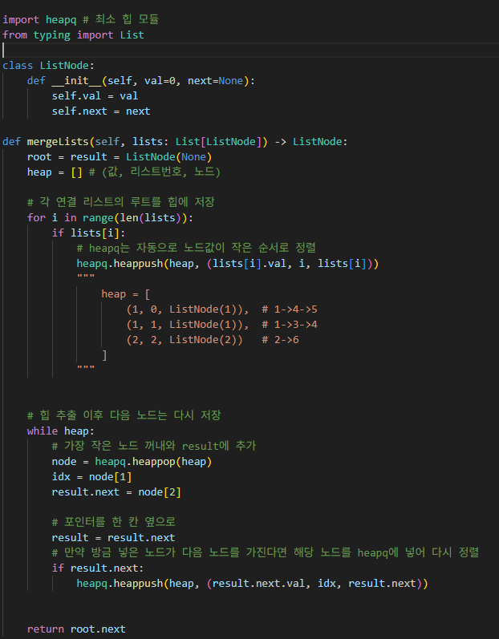

# K개 정렬 리스트 병합
여러 개의 오름차순으로 정렬된 연결 리스트가 주어졌을 때, 하나의 정렬된 연결 리스트로 병합하기

---

**접근 방식**

1. 최소 힙 초기화
   - 각 리스트의 첫 노드를 `(값, 리스트 번호, 노드)` 형태로 저장합니다.  
   - `heapq` 모듈 : 값이 작은 순서대로 자동 정렬

2. 각 연결 리스트의 루트 노드를 힙에 추가

3. 힙에서 가장 작은 노드를 꺼냄
   - 결과 리스트에 해당 노드를 연결
   - 꺼낸 노드의 다음 노드가 있다면 힙에 다시 추가 (자동으로 정렬됨)

4. 힙이 빌 때까지 반복

---
**구현 코드**
  
