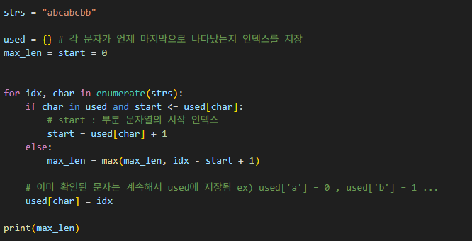

# 중복 없는 가장 긴 부분 문자열의 길이 찾기

**문제 설명**
문자열 `strs`가 주어졌을 때, 중복 문자가 없는 가장 긴 연속 부분 문자열의 길이를 구하기

---

**[접근방식]**
- 문자열을 좌우 포인터로 좁혀가며 확인하되, 중복 문자가 발견되면 시작 포인터(start)를 이동
- 각 문자가 마지막으로 나타난 위치를 기록해 두고, 해당 위치 이후로 윈도우를 이동시키기

---

**구현 코드**
 
