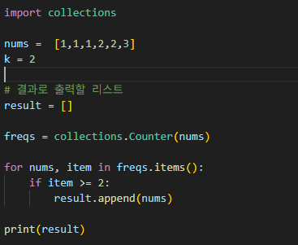

# 상위 K 빈도 요소
주어진 정수 리스트 `nums`에서 중복된 횟수가 특정 기준 `k` 이상인 요소들만 추출하여 리스트로 반환

---

**[접근 방식]**
collections 라이브러리의 Counter 메서드 사용, K번 이상의 빈도를 가진 요소만 `result` 리스트에 추가해서 반환

- 시간복잡도: O(n) -- 리스트를 한 번 순회
- 공간복잡도: O(n) -- `freqs` + `result` 가 차지하는 공간

---

**작성한 코드** 
 
