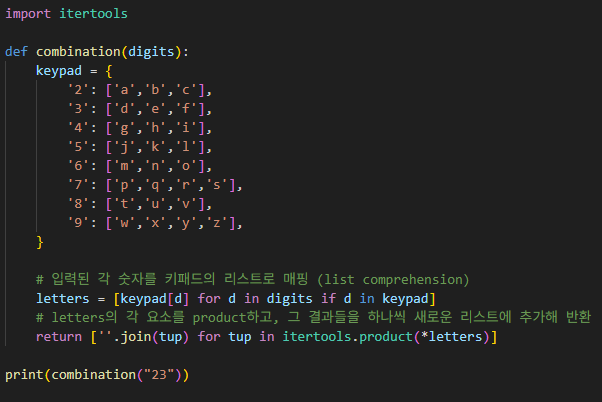

# 전화 번호 문자 조합
주어진 숫자 문자열을 휴대폰 키패드 문자로 매핑하여, 모든 가능한 문자 조합을 생성하라

---

**[접근 방식]**

**itertools 모듈 사용**
1. 각 숫자를 키패드 딕셔너리에서 대응되는 문자 리스트로 변환
2. 변환된 문자 리스트들의 Cartesian product을 구함
3. product 결과(튜플)를 문자열로 합쳐 최종 리스트에 저장
4. 결과 리스트를 반환

- 시간복잡도: O(n * 4^n)
- 공간복잡도: O(n * 4^n)
- n = 입력된 문자열 길이

---

**작성한 코드** 
 

