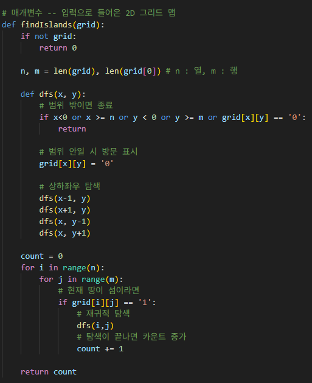

# 섬의 개수
2D 그리드 맵이 주어질 때, 연결된 부분의 개수를 구하라

---

**[접근 방식]**

**DFS 알고리즘 재귀적으로 사용하기**
1. 2중 for문으로 전체 격자를 탐색
2. 격자가 육지라면, DFS알고리즘 호출
3. DFS는 상하좌우 방향으로 연결된 모든 육지를 '0'으로 변경(방문 처리)
4. 하나의 DFS가 끝나면 섬의 개수(count)를 1 증가
5. 모든 격자를 탐색할 때까지 반복

- 시간복잡도: O(n) -- 모든 칸을 한 번씩만 방문
- 공간복잡도: O(1) -- 추가 자료구조 없이 grid 자체 수정

---

**작성한 코드** 
 

