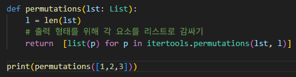

# 순열
주어진 리스트의 모든 가능한 순서를 생성하는 문제
---

**[접근 방식]**

**itertools.permutations 사용**
1. 입력 리스트 lst 길이를 l로 설정하고, r = l로 지정하여 전체 순열을 생성
2. 결과 튜플을 list()로 변환하여 리스트의 리스트 형태로 반환

- 시간복잡도: O(n×n!) -- 리스트를 한 번만 순회 (n! = 순열의 개수, n = 순열의 길이)
- 공간복잡도: O(n×n!) -- 결과 리스트 저장 크기
---

**작성한 코드** 
 

