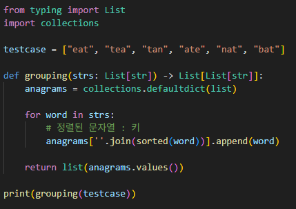
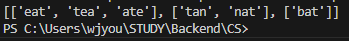

# 그룹 애너그램
리스트에서 애너그램을 판단하여 새로운 리스트에 각각 저장하는 문제

---

**[접근 방식]**

**정렬한 단어를 키값으로 리스트에 추가**
- 파이썬에서 기본으로 제공하는 sorted() 메서드를 사용하여 제공되는 문자열들을 하나하나 정렬한다.
- `sorted()`는 병합 정렬 매커니즘의 정렬 방식으로, 코드가 간결하고 속도가 빠르다는 이점이 있다.
- 정렬된 문자열은 딕셔너리의 키로 사용되고, 값의 리스트에 원본 문자열을 저장한다.

단어의 개수가 n, 단어의 길이가 k일 경우 
시간복잡도: O(n) * O(k log k) 
공간복잡도: O(n) * O(k)

---

**작성한 코드와 결과** 
 

--- 

**정리**
정렬된 키를 기준으로 그룹핑하는 전략을 연습할 수 있었다. 
이 내용을 기반으로 HashMap 기반 그룹핑, 문자열 normalization, 중복 제거 등에서 사용할 수 있을 것 같다 

[활용방안]
*검색엔진 자동 교정 시스템*
   - 철자 순서가 섞인 유사 단어들을 같은 단어군으로 묶어 추천할 수 있다.
   - 예: 사용자가 `"goolge"` 입력 시 `"google"` 자동 추천.

*태그 자동 정렬*
   - 유사한 해시태그나 키워드들을 정렬 기준으로 그룹화하여 자동 정렬하는 기능
