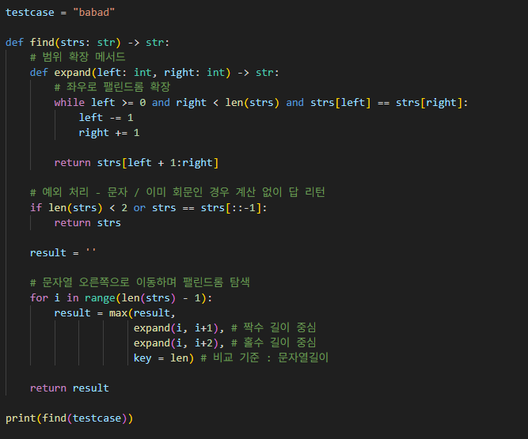
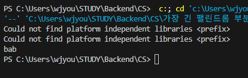

# 가장 긴 팰린드롬 부분 문자열
문자열 내에서 가장 긴 팰린드롬 부분을 구하는 문제

---

**[접근 방식]**

**1. DP 방식으로 풀기**
- 널리 알려진 방식으로, 부분해를 구해 결과를 업데이트하며 풀어가는 방식
- 시간복잡도가 평균적으로 O(n²)
- 공간복잡도 또한 평균적으로 O(n²)
- 가독성이 좋지 않고, 코드의 길이가 길어짐

**2. 투 포인터로 풀기**
- 배열 내 두 인덱스를 움직이며 조건탐색
- 시간복잡도는 일반적으로 O(n) or O(n²)
- 공간복잡도는 O(1)
- 코드의 직관성이 뛰어나며, 간결하게 작성 가능
---

**작성한 코드와 결과** 
  

---

**정리**
실시간으로 탐색하여 빠르게 결과를 제공해야할 경우, 투 포인트와 같은 방식을 사용하는 것이 좋으며  
모든 경우를 저장하여 이전 결과를 재활용 해야 하거나, 안정적으로 최적해를 보장해야할 경우 DP를 사용하는 것이 좋다.
