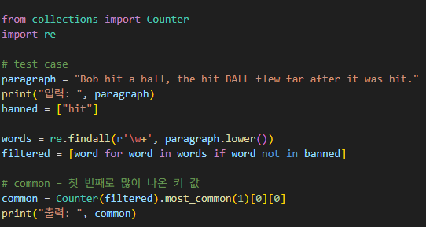
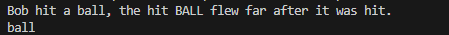

# 가장 흔한 단어 찾기
특정 문자열에서 금지된 단어를 제외하고, 가장 많이 나온 단어를 출력하는 문제
(대소문자 구분 x, 구두점 등 특수문자 무시)

---

**[접근 방식]**
_*기본적 처리*_ 
대소문자 구분 없음 → 모두 소문자로 변경 
금지단어 → `[word for word in words if word not in banned]` 으로, 금지단어를 제외하고 새로운 리스트를 생성한다. 

**re 모듈 사용**
- re모듈을 사용하여 문자열에서 사용된 단어만 새로운 리스트로 골라낸다.

**Collection 사용**
- 파이썬 내부 기능인 Counter()을 사용하여 코드의 가독성 및 간결성을 확보한다.

시간복잡도: O(n) - 입력된 문장의 길이와 비례 
공간복잡도: O(n) - 서로 다른 단어의 개수만큼 필요 

---

**작성한 코드와 결과** 
 

---

**[정리]**
