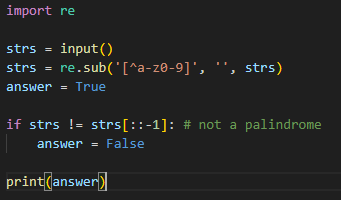
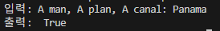

# 회문 구분 문제
사용자로부터 입력받은 문자열이 회문(palindrome)인지 판별하는 문제
(대소문자 구분 x, 알파벳과 숫자만 사용)

---

**[접근 방식]**
_*기본적 처리*_ 
대소문자 구분 없음 → 모두 소문자로 변경
공백/특수문자 제외 → re모듈의 정규표현식 사용

---

**1. 리스트 기반 접근**
- 문자열을 리스트 구조로 사용하여 'pop()'을 사용해 앞 뒤 문자를 비교할 수 있다. 이 경우, Python의 'list.pop()'의 내부적으로 모든 요소를 한 칸씩 당기는 작업때문에 O(n)의 시간복잡도를 가지고, 총 n번 반복해야 모든 문자를 비교할 수 있기 때문에 전체 시간 복잡도는 O(n²)가 된다. 

**2. 데크 기반 접근**
- 'collections.deque()'는 양쪽 끝에서 O(1)의 시간복잡도로 삽입/삭제가 가능하다. 따라서 'popleft()', 'pop()'을 통해 양방향 비교를 진행 시, 전체 시간 복잡도는 O(n)으로 효율적이며, 링 버퍼 형태로 구현된 데크의 특성으로 인해 대규모 데이터를 다룰 때 리스트보다 유리하다.

**3. 슬라이싱 기반 접근**
- 문자열 자체를 's == s[::-1]' 방식으로 슬라이싱을 통해 판단하는 방식은 별다른 자료구조를 사용하지 않으며, 시간 복잡도는 O(n)이다. 또한 Python의 슬라이싱 작업은 C로 작성된 내부 구현을 통해 처리되므로, 파이썬에서 제공하는 데크 활용 로직보다 훨씬 빠른 실행 성능을 보인다.

---

**작성한 코드와 결과** 
 

---

**[정리]**
문제의 요구사항이 소량의 문자열을 판별할 경우, 슬라이싱 기반 방법이 간결하고 빠르며  
대규모의 데이터나 복잡한 조건 분기가 필요한 경우 데크를 사용하는 방식이 더 활용적일 수 있다.
