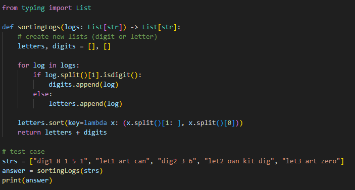
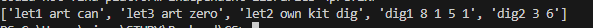

# Reorder Log Files

<조건>
1. 로그의 가장 앞 부분은 식별자이다 (dig2, let1)
2. 문자로 구성된 로그가 숫자 로그보다 앞에 온다
3. 문자의 경우 알파벳순으로 정렬되고, 문자가 동일한 경우 식별자 순서로 정렬된다
4. 숫자 로그는 입력한 순서대로 정렬된다

---

**[접근 방식]**
- 1. 입력을 문자 로그와 숫자 로그로 분리
- 2. 문자 로그는 `(내용, 식별자)`를 기준으로 정렬
- 3. 문자 로그 + 숫자 로그 순으로 병합하여 반환

시간복잡도 : `O(n log n)`  
  - 문자 로그 정렬(`sort()`)에 의해 결정
공간복잡도 : `O(n)`  
  - 문자 / 숫자 로그를 저장하기 위한 별도 리스트 사용

---

**작성한 코드와 결과** 
 

---

**실무 활용 방안**
- 웹 서버 또는 애플리케이션 서버의 로그 파일을 정렬시켜 우선순위가 높은 문자 로그를 배치하고 숫자 로그는 원래 순서대로 유지
- 우선 정렬 기준 + 부차 정렬 기준의 키 정렬 알고리즘
