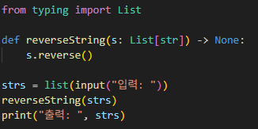
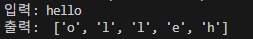

**[문제]**
사용자로부터 배열 형태로 입력받은 문자열을 리턴값 없이 바로 해당 배열을 뒤집는 함수를 만들어라.
<예시 입력>
["h", "e", "l", "l", "o"]
<예시 출력>
["o", "l", "l", "e", "h"]

---

**[접근 방식]**

**포인터 사용**
- 포인터 두 개를 사용하며 배열의 끝과 끝부터 중앙으로 가며 두 문자를 스왑하는 방식으로, 추가 메모리 사용 없이 문자를 바꿀 수 있다.
- 시간 복잡도는 O(n), 공간복잡도는 O(1)이다.
  
**내장 기능 사용**
- 파이썬의 기본 기능인 `reverse()` 메서드를 사용한다. 이 함수는 리스트에만 제공되지만, 코드가 간결하고 직관적이다.
- 시간 복잡도는 O(n), 공간복잡도는 O(1)이다.
---

**작성한 코드와 결과** 
 

