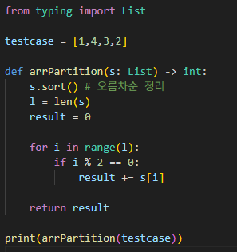

# 배열 파티션1
n개의 페어를 이용한 min(a,b)의 합으로 만들 수 있는 가장 큰 수 구하기

---

**[접근 방식]**
**그리디 방식 사용**
오름차순 정렬을 통해 수를 pair형태로 구성하고, 짝수 인덱스끼리 합친다. 
원리: 가장 큰 합은 작은 수끼리 짝을 이루어야 한다. (작은 수, 큰 수)로 pair을 이루게 되면, 큰 수가 버려지기 때문

- 시간복잡도: O(n log n) -- Timsort 수행
- 공간복잡도: O(1) -- 재자리 정렬 수행

---

**작성한 코드** 
 
