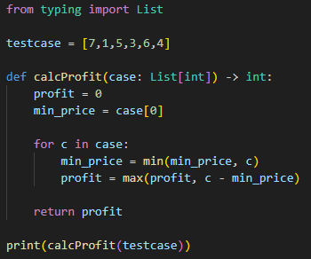

# 주식을 사고팔기 가장 좋은 시점
주식의 가격이 리스트 형태로 주어질 때, 가장 큰 이익을 출력하라.

---

**[접근 방식]**

**가격의 최솟값을 갱신하며 최대이익 구하기**
1. 리스트를 앞에서부터 순회하면서 최솟값(min_price) 을 계속 갱신
2. 각 시점에서의 이익은 `현재값 - min_price`로 계산
3. 이익이 기존보다 크면 최대이익(profit) 을 갱신

- 시간복잡도: O(n) -- 리스트를 한 번만 순회
- 공간복잡도: O(1) -- 추가 공간 필요 없음

---

**작성한 코드** 
 

