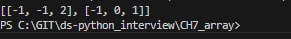

# 세 수의 합
리스트의 요소 중 세 수의 합이 0이 되는 요소를 리스트에 담아 반환하기

---

**[접근 방식]**

**1. 브루트 포스**
- 세 개의 수를 중첩 반복문으로 모두 확인  
- 시간복잡도: `O(n³)`  
- 중복 제거가 어려움

**2. 투 포인터**
- 리스트를 오름차순으로 정렬, 고정된 첫 번째 수를 기준으로 나머지 두 수는 양 끝에서 투 포인터로 탐색
- sum 값에 따라서 포인터 이동
- 중복 제거 쉬움
- 시간복잡도: **O(n²)**

---

**작성한 코드와 결과** 
 

