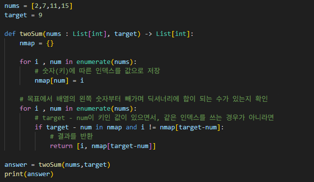
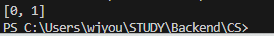

# 두 수의 합
숫자로 구성된 리스트에서 목표에 해당하는 합을 만들 수 있는지 판별하고, 인덱스를 반환하는 문제

---

**[접근 방식]**

**1. 브루트 포스**
- 가장 기본적인 방법으로, 두 수의 모든 경우의 수를 구하면서 해를 구하는 방식이다.
- 시간복잡도가 `O(n²)`으로, 지나치게 느려 잘 사용하지 않는다.

**2. in 연산 사용**
- 파이썬에서 in 연산자는 찾고자 하는 데이터가 있는지 없는지를 boolean 값으로 반환한다.
- 이를 이용해 입력으로 주어지는 리스트의 숫자를 차례대로 목표에서 빼가며 짝이 맞는 숫자가 있는지 찾는다.
- 이 방식은 가독성이 좋고, 배열을 한 번만 순회하면서 각 수에 대해 해시맵을 이용해 상수 시간으로 검색하므로 `O(n)`의 시간 복잡도를 가짐.

---

**작성한 코드와 결과** 
 

--- 

**정리** 
| 방식 | 시간복잡도 | 공간복잡도 | 특징 |
|------|------------|------------|------|
| 브루트 포스 | O(n²) | O(1) | 느림, 직관적 |
| 해시맵 | O(n) | O(n) | 빠름, 대용량 데이터에 적합 |

- 회계 프로그램에서 거래를 검토할 때 해시맵을 사용하는 것이 유용한 방법이 될 수 있겠다.
- 또한, 사용자 행동 로그에서 특정 조건(예: 합산 시간이 1분이 되는 두 요청)을 찾을 때도 효율적으로 활용할 수 있을 것이다.
