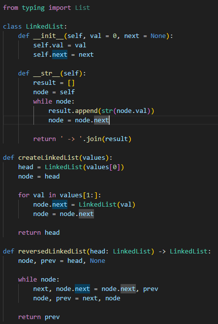
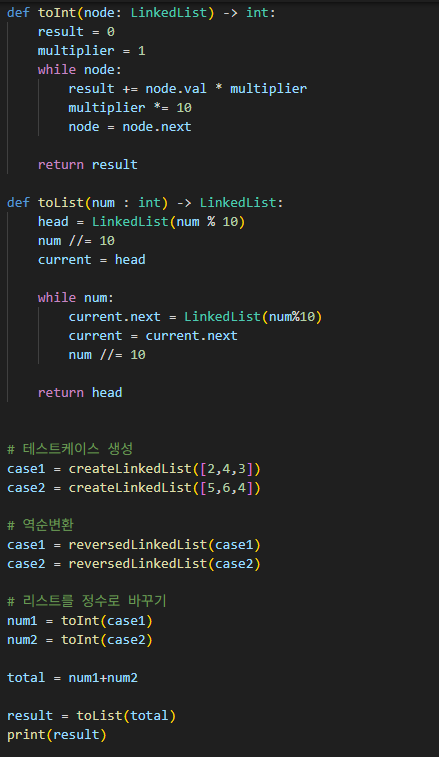

# 역순 연결 리스트 두 수의 덧셈
역순으로 저장된 연결 리스트 두 개가 주어질 때, 이 두 수를 더한 값을 다시 연결 리스트 형태로 반환하라

---

**[접근 방식]**

**연결 리스트 → 정수 변환 → 덧셈 후 연결 리스트 변환**
1. 각 연결 리스트를 역순으로 변환하여 자릿수 순서 복구
2. 각 리스트를 정수형 숫자로 변환
3. 두 정수를 더한 후 결과값을 다시 연결 리스트로 변환
4. 반환된 연결 리스트는 문제 조건에 따라 역순 형태로 구성됨

- 시간복잡도: O(n) -- 각 연결 리스트를 한 번씩 순회
- 공간복잡도: O(n) -- 새로운 연결 리스트 생성

---

**작성한 코드** 
 
 

---

**느낀점**
- 연결 리스트 구조를 정수 연산에 맞게 변환하고 다시 복원하는 과정을 연습할 수 있었음
- 서비스나 백엔드 개발에서 유저 입력이 순차적 / 비정형적으로 들어오는 상황에서 리스트-정수 변환 로직이 API 처리나 데이터 전처리에서 실용적으로 쓰일 수 있다고 생각
