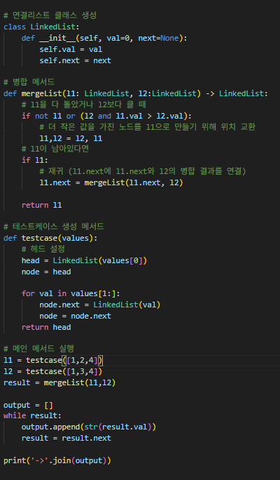

# 정렬된 두 연결 리스트 병합
오름차순으로 정렬된 두 연결 리스트가 주어졌을 때, 이를 하나의 정렬된 리스트로 병합하여 반환하라.

---

**[접근 방식]**

**재귀 호출을 이용한 병합 정렬 방식**
1. 두 리스트의 현재 노드 중 더 작은 값을 가진 노드를 선택
2. 선택된 노드를 기준으로 다음 노드에 대해 재귀 호출 수행
3. 선택된 노드의 next에 병합 결과를 연결
4. 두 리스트 중 하나가 끝나면 남은 리스트를 그대로 이어 붙임

- 시간복잡도: O(n + m) -- n, m은 각각의 리스트 길이
- 공간복잡도: O(n + m) -- 재귀 호출 스택 사용
- 
---

**작성한 코드** 
 

**느낀점 및 구현 포인트**
- 정렬된 리스트를 통합하거나, 파일 병합, 시간 순 정렬 등 다양한 상황에 적용할 수 있는 재사용성 높은 패턴이라는 점에서 의미 있는 문제였다.
- 리스트 간 위치교환을 하는 부분에서 숙련도를 향상시킬 수 있었다.
