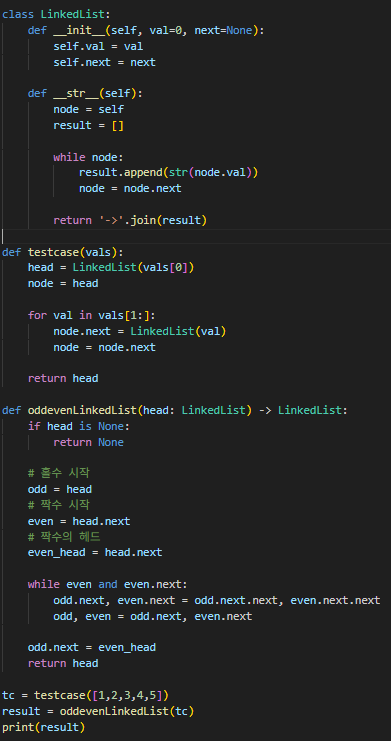

# 홀짝 노드 분리 정렬  
연결 리스트가 주어졌을 때, 홀수 번째 노드들을 먼저 연결하고 그 뒤에 짝수 번째 노드들을 연결하여 새로운 리스트를 구성하라.

---

**[접근 방식]**

**홀수/짝수 노드를 각각 분리 후 재결합**  
1. `odd`, `even` 두 포인터를 각각 1번 노드와 2번 노드에서 시작  
2. `odd.next`는 다음 홀수 노드로, `even.next`는 다음 짝수 노드로 이동  
3. 홀수/짝수 리스트가 각각 연결되도록 조작  
4. 반복문 종료 후 홀수 리스트의 끝을 짝수 리스트의 시작에 연결  

- 시간복잡도: O(n) — 리스트를 한 번만 순회  
- 공간복잡도: O(1) — 추가 리스트 없이 포인터만 사용  

---

**작성한 코드**   
 

---

**[느낀점 및 구현 포인트]**
- 별도의 배열이나 리스트를 만들지 않고 포인터만으로 리스트 구조를 재정렬하는 로직을 구현하면서, 연결 리스트의 구조적 특성을 직접 다루는 경험이 되었다.  
- 실무에서 메모리 제약이 있는 환경에서 유용할 것으로 생각된다.  
- 리스트 내 노드 재배치 알고리즘의 기본 원리를 이해하는 데 도움이 되었다.
