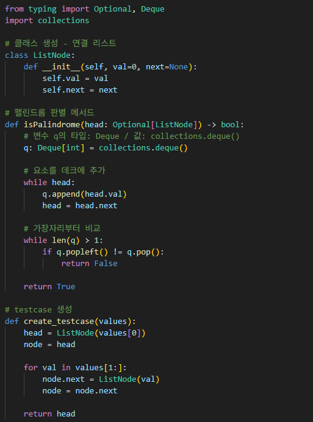

# 팰린드롬 연결 리스트
연결 리스트가 주어졌을 때, 값들을 앞뒤로 읽었을 때 같은지 판별하라.

---

**[접근 방식]**

**데크(Deque)를 활용한 양끝 비교 방식**
- 연결 리스트를 순회하며 각 노드의 값을 collections.deque에 저장
- 데크의 양쪽 끝에서 하나씩 꺼내어 앞뒤가 같은지 비교
- 한 쌍이라도 다르면 False 반환, 끝까지 같으면 True 반환
- 시간복잡도: O(n) -- 연결 리스트 전체를 한 번 순회 + 데크 비교
- 공간복잡도: O(n) -- 모든 값을 데크에 저장

---

**작성한 코드** 
 

