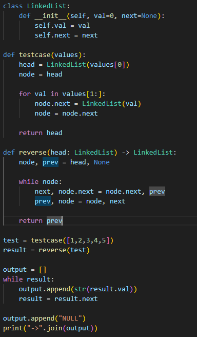

# 역순 연결 리스트
주식의 가격이 리스트 형태로 주어질 때, 가장 큰 이익을 출력하라.

---

**[접근 방식]**

**반복문을 통한 포인터 조작 방식**  
1. 현재 노드를 순회하면서 이전 노드를 가리키도록 포인터 방향을 뒤집음  
2. 다음 노드를 미리 저장해 두고 연결을 끊은 뒤, 현재 노드의 `.next`를 이전 노드로 설정  
3. 반복문이 끝날 때 `prev`가 새 헤드가 됨  

- 시간복잡도: O(n) — 모든 노드를 한 번씩 순회  
- 공간복잡도: O(1) — 추가 자료구조 없이 포인터만 사용  

---

**작성한 코드**   
 

---

**[느낀점 및 구현 포인트]**
- 포인터를 사용하여 `in-place` 알고리즘을 연습할 수 있는 문제였다.
- 별도의 배열이나 스택 없이 문제를 해결함으로써 공간 효율성을 확보하였다.
