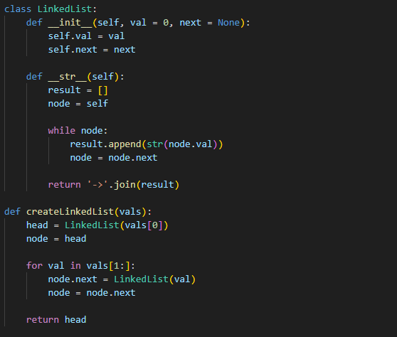
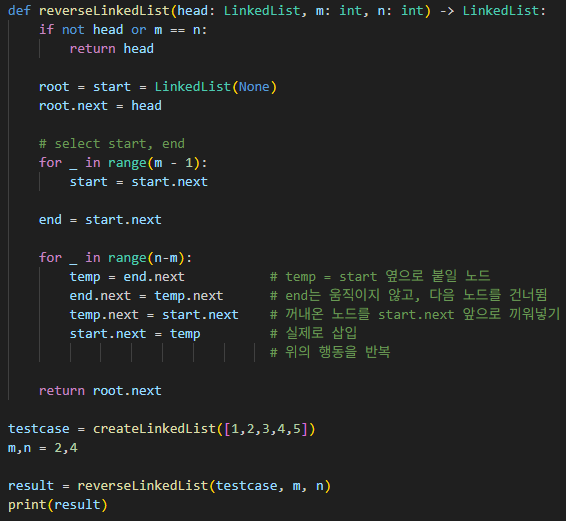

# 부분 연결 리스트 뒤집기 (Reverse Linked List II)
연결 리스트와 두 개의 인덱스 `m`, `n`이 주어졌을 때,  
`m`번째 노드부터 `n`번째 노드까지를 역순(reverse)으로 뒤집어 전체 리스트를 반환하라.

---

**[접근 방식]**

**중간 구간만 분리하여 연결 재배치 (Head Insertion 방식)**  
1. `start`는 `m-1`번째 노드를 가리키게 하고, `end`는 `start.next`에서 시작  
2. `start.next` 다음에 오는 노드들을 하나씩 꺼내어 앞쪽으로 끼워넣는 방식으로 연결 재정렬  
3. 이를 `n - m`번 반복하면 `m ~ n` 구간이 역순으로 정렬됨  

- 시간복잡도: O(n) — 전체 리스트를 한 번 순회  
- 공간복잡도: O(1) — 포인터만으로 처리, 추가 자료구조 없음  

---

**작성한 코드**   
 
 

---

**[느낀점 및 구현 포인트]**
- 이전에 사용한 `in-place` 알고리즘을 더 난이도 있게 연습할 수 있었다.
- 포인터를 이용한 부분 처리 로직을 익히는 데 적합한 예제였다.
