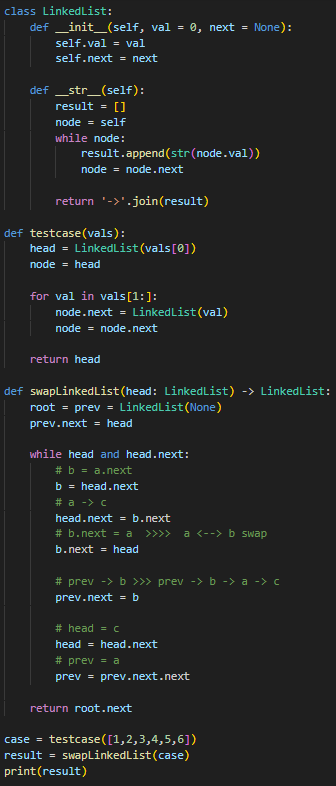

# 인접 노드 교환 (Swap Nodes in Pairs)

연결 리스트가 주어졌을 때, 인접한 노드 두 개씩을 서로 교환하여 새로운 리스트를 반환하라.

예시)  
입력: 1 → 2 → 3 → 4 → 5 → 6  
출력: 2 → 1 → 4 → 3 → 6 → 5

---

**[접근 방식]**

**포인터 조작을 통한 반복적 쌍 교환**  
1. 더미 노드(`root`)를 두고 `prev` 포인터로 스왑 직전 노드를 추적  
2. 현재 노드(`head`)와 그 다음 노드(`b`)를 스왑  
   - `head.next`를 `b.next`로  
   - `b.next`를 `head`로  
   - `prev.next`를 `b`로 연결  
3. 다음 쌍으로 포인터 이동  
   - `head`는 다음 노드로  
   - `prev`는 스왑 후 뒤쪽 노드로  

- 시간복잡도: O(n) — 리스트 전체를 한 번 순회  
- 공간복잡도: O(1) — 별도 리스트 없이 포인터만 사용  

---

**작성한 코드**   
 

---
